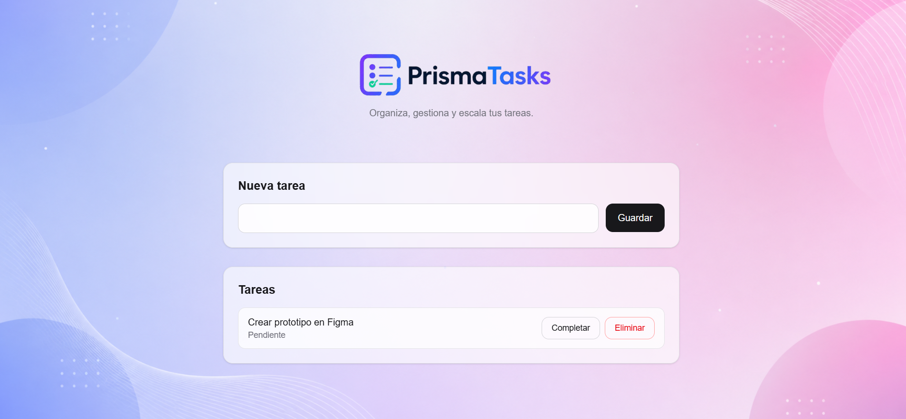

# PrismaTasks

Gestor de tareas full-stack con Next.js, Prisma y Supabase.

[Ver demo en vivo](https://crudnapp.netlify.app/)

## Preview

[](https://crudnapp.netlify.app/)

## Stack

- Next.js 16
- React 19
- TypeScript
- Prisma 7
- Supabase PostgreSQL
- Tailwind CSS 4
- Netlify

## Funcionalidades

- Crear tareas.
- Marcar y desmarcar como completadas.
- Eliminar tareas.
- Persistencia en base de datos.

## Variables de entorno

```env
DATABASE_URL="postgresql://..."
DIRECT_URL="postgresql://..."
```

## Correr en local

```bash
npm install
npx prisma generate
npm run dev
```

## Deploy

El proyecto está desplegado en Netlify.  
Asegúrate de configurar las variables de entorno en producción.
